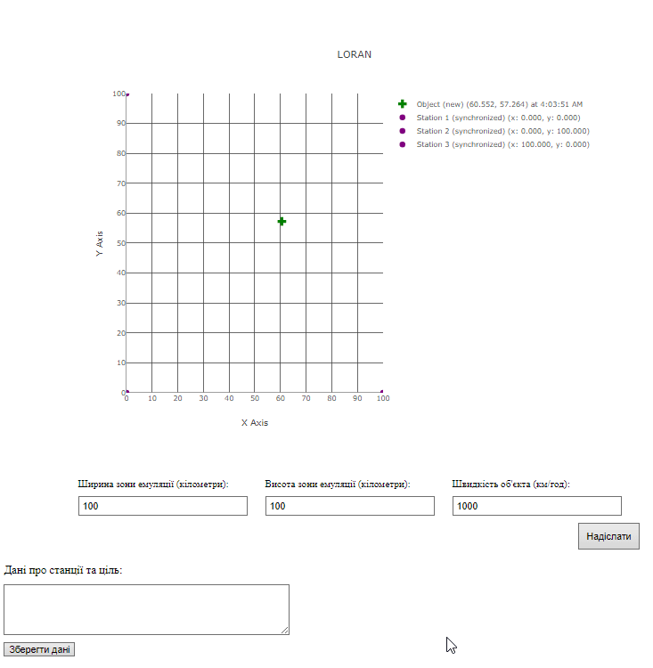

## Розробка додатку для візуалізації вимірювань LORAN. Колєснік Євгеній ІПЗ-4.01

## Мета

Розробити додаток, який зчитує дані з емульованої вимірювальної частини LORAN, наданої у вигляді Docker image, та відображає положення об'єкта і базових станцій на графіку в декартових координатах.

## Завдання

Згідно до поставленого завдання необхідно було створити додаток, що в реальному часі відображає дані положення об'єкта на графіку за допомоги `LORAN` та дозволяє змінювати параметри емулятору станцій.

1. Розробити додаток для відображення положення об'єкта і базових станцій:
    - Розробити веб-додаток, який підключається до `WebSocket` сервера та зчитує дані про часи отримання сигналів базовими станціями;
    - Використовувати різниці часу прибуття сигналів для розрахунку місцезнаходження об'єкта;
    - Відобразити отримані дані на графіку в декартових координатах.
2. Обробка та візуалізація даних:
    - Обробити дані, отримані через WebSocket, і відобразити положення об'єкта і базових станцій на графіку;
    - Здійснити розрахунок координат об'єкта за допомогою методу найменших квадратів та градієнтного спуску.
3. Налаштування графіка:
    - Відобразити координати базових станцій та об'єкта у декартових координатах;
    - Використати різні кольори або стилі точок для відображення базових станцій та об'єкта.

## Конфігурація

Емулятор вимірювальної частини LORAN надається у вигляді Docker зображення під назвою loran-emulation-service.

Завантажимо зображення з Docker Hub:

> docker pull iperekrestov/university:loran-emulation-service

Запустимо контейнер з ім'ям `loran-e` на порту `4002` для з'єднання з емульованою вимірювальною частиною loran:

```bash
 docker run --name loran-e -p 4002:4000 iperekrestov/university:loran-emulation-service
```

## API

Сервіс підтримує API для зміни наступних параметрів LORAN:

**emulationZoneSize** - розмір зони емуляції;
**objectSpeed** - швидкість руху об'єкта.

За замовчуванням застосовані наступні параметри:

**emulationZoneSize** - 100x100 км;
**objectSpeed** - 100 км/год.

Дані надсилаються через WebSocket містять інформацію про дані базових станцій та передаються у форматі JSON:

```bash
{
  "id": "uuid", // Унікальний ідентифікатор повідомлення (UUID)
  "sourceId": "source_x",  // Ідентифікатор базової станції, яка надіслала сигнал
  "receivedAt": 1692170400100 // Час отримання сигналу базовою станцією (мілісекунди з початку епохи Unix)
}
```

## Технології

Для створення додатку візуалізації `LORAN` були обрані `JavaScript`, `HTML` і `CSS` для створення інтерактивного інтерфейсу. Графіки реалізовані за допомогою `Plotly`. Серверна частина налаштована на `Express` з middleware для проксі, що спрощує обробку запитів і маршрутизацію, а також використовує Node.js для виконання коду. Управління залежностями відбувається через npm. Обчислення координат здійснюється на сервері з `Python` за допомогою `flask` і алгоритмів методу найменших квадратів та градієнтного спуску.

## CORS

Щоб браузер міг надсилати запити (наприклад, POST, PUT) до конфігураційного сервера Docker радара (http://localhost:4002/config), веб-сервер повинен дозволяти ці запити з інших доменів.

Виявлено, що сервер не відповідав на OPTIONS запити. Для вирішення цього налаштовано проксі-сервер на порту 3000, що перенаправляє запити на http://localhost:4002 з використанням `express` і `http-proxy-middleware`.

Конфігурація включає:

- Проксі для API з обробкою заголовків CORS;
- Обробку статичних файлів з директорії public;
- Відповідь на запити до кореневого маршруту, надаючи HTML-файл.
- Налаштування сервера виконано у файлі proxy.js

Запуск проєкта виконується так:

> node proxy.js

## Приймання повідомлень

Для приймання повідомлень від радару було створено клас `LORANService`, файл `public/src/LORANService.js`. Він відповідальний за отримання `fetchConfiguration` та оновлення конфігурації `updateConfiguration`, а також за підключення до веб-сокета емудятора радару `connectWebSocket`. Його конструктор приймає адресу для конфігурації, адресу сокета та назву події, яку генерує сервіс для кожного повідомлення сокета.

## Зберігання данних базових станцій

Для зберігання та обробка данних від базових станцій було створено клас `LORANStorage`, файл `public/src/LORANStorage.js`. Він відповідає за збергігання даних базових станцій, обробку нових повідомлень від них та повертає оформлені дані щодо стану базових станцій та обчисленої цілі.

## Обчислення координат об'єкту за допомоги різниці часу прибуття сигналів

Для обчислення положення цілі було створено клас `LORANCalculator`, файл `public/src/LORANCalculator.js`. Він звертаючись до API пайтон скрипта за допомоги різниці часу прибуття сигналів обчислює положення цілі.

## Будування графіку

Для будування графіку LORAN був створений клас `LORANGraph`, файл `public/src/LORANGraph.js`. Він відповідає за прийняття оброблених даних з веб-сокету та малювання графіку на основі оброблених даних. Він стилізує станції відповідно до статусів їх активності.

## Конфігурація

Для відображення та зміни значень конфігурації LORAN, було створено клас `Config`, файл `public/src/Config.js`. Він відповідає за оновлення конфігурації LORAN та встановлення конфігурації до форми. У конструкторі він приймає калбек, якому передається зчитана з форми конфігурація LORAN.

## Головний асинхроний скрипт

Головний скрипт ініціалізує систему `LORAN` для відображення та обробки даних про об'єкт і станції в реальному часі. Спочатку імпортуються необхідні модулі: `LORANService`, `LORANGraph`, `Config`, `LORANStorage` та `LORANCalculator`. Встановлюються параметри `LORANService`, такі як URL для конфігурації та WebSocket-з'єднання. Далі створюються екземпляри `LORANService`, `LORANGraph` та `LORANStorage`, після чого запускається функція main. У main спочатку завантажується конфігурація для loranService, потім виконується підключення до WebSocket. Створюється об'єкт Config, який оновлює параметри `LORANGraph` та `LORANService` при внесенні змін у форму конфігурації. Після отримання даних події `LORANDataReceived` зберігаються координати та статуси станцій у loranStorage. Завершуючи ініціалізацію, `LORANGraph` отримує початкову конфігурацію та відображає дані на графіку. 

## Перевірка

Запустимо проєкт, перевіримо працю LORAN, оновлення конфігурації та збереження даних:

Результат:



LORAN успішно в реальному часі відображає дані веб-сокету про положення цілі, дозволяє змінювати конфігурацію та зберігати дані цілі за потрібності.

## Висновок

Виконуючи цю роботу я  підтвердив теоретичний матеріал з теми розробки додатку для візуалізації вимірювань LORAN. Під час виконання роботи я розробив додаток, який зчитує дані з емульованої вимірювальної частини LORAN, наданої у вигляді Docker image, та відображає положення об'єкта і базових станцій на графіку в декартових координатах.

Loran — це радіонавігаційна система для визначення позиції та часу за допомогою низькочастотних радіосигналів від наземних станцій. Вона забезпечує точність 10-30 метрів, що корисно для морської та авіанавігації, особливо там, де GPS недоступний або ненадійний. Працюючи на низьких частотах, Loran стійкий до атмосферних перешкод, не залежить від супутників і може використовуватися як резервна система навігації.

Отриманні знання є основою при розробці  систем пов'язаних з роботою з координатами.